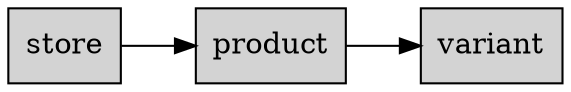

% Document-Relational Lab

In this week's lab we'll look at the key limitations of the document store model alone and how we can use document storage features in relational databases as an alternative.

We will use `psql` and via Python in `ipython3` using `psycopg2` libraries.
We'll also again use the the python `requests` library to pull in JSON-formatted data from internet URLs and store it in PostgreSQL.

Today's lab shows some of the possibilities of using a relational DB to work with primarily document data, using its document types.
Today's lab is rather opinionated and simplified, note that there are many equivalent ways to do the same operations shown here.


**Important links:**

- [Python Requests Library](https://requests.readthedocs.io/en/latest/)
- [Psycopg2](https://www.psycopg.org/docs/)
- [PostgreSQL JSONB types](https://www.postgresql.org/docs/16/datatype-json.html)

*Some basic concepts from PostgreSQL last semester are re-capped in this lab.*


# Connecting

## Remote or laptop students

*Skip if on a lab machine*

[Connect to the VPN](https://dkitvpn.dkit.ie) at the beginning of this class.


## Login to the shared server

As per last week, we'll login to the shared lab server.

```bash
ssh yourname@10.200.172.60
```


# PostgreSQL

## New TMUX window

Type `Ctrl-B c` to make a new tmux window where we'll run `psql` (next step).


## Connect

In our new tmux window we'll use `psql` to connect to PostgreSQL:

```bash
psql
```

Output should look like:

	psql (16.6 (Ubuntu 16.6-0ubuntu0.24.04.1))
	Type "help" for help.

	grantp=> 

(If you are looking at my screen during class you'll probably notice that the prompt looks slightly different `grantp=#`.
The hash sign is because I have superuser privilages.)


# Document databases

- Great for ingesting large volumes of data where we don't know the *schema* in advance.
- We don't have to design database / tables to store data we may never retrieve.
- Allow ease of searching docs once loaded
- Aligned with Python (and other language) dictionary / collection formats.

## Problems

- Loose structure around datatypes
- Advanced querying needs a lot of time investment
- Some things from relational databases *aren't* possible.

## Document data in relational databases

## Documents as TEXT

In theory there would be nothing to stop you using a `TEXT` column to store JSON documents:

- Very useful if the JSON documents are *additional* data that you don't intend using in foreign keys, JOINS or searching on.
- Most useful where the additional data is to support a specific program / service / application that requires it.


## JSON / JSONB types

However, PostgreSQL also supports the `JSON` and `JSONB` column types.
Highly recommend [reading the JSON types documentation](https://www.postgresql.org/docs/16/datatype-json.html).
Key points:

- JSON data types enforce stored data validity according to the JSON rules.
- JSON-specific functions and operators available for data stored in these types.

There are 2 types: 

### JSON

The `json` data type stores an exact copy of the input text, which processing functions must reparse on each execution.

Because the json type stores an exact copy of the input text:

- it will preserve semantically-insignificant white space between tokens
- it will preserve the order of keys within JSON objects
- Also, if a JSON object within the value contains the same key more than once (not valid!), all the key/value pairs are kept. *The processing functions consider the last value as the operative one.*


### JSONB

The `jsonb` stores data in a decomposed binary format:

- slower to input due to added conversion overhead
- significantly faster to process, since no reparsing is needed
- supports indexing

*Due to how JSONB works there are some unusual cases where JSONB will reject valid JSON data, due to issues mapping it to Postgres types. You'll probably never encounter this.*

**In general, prefer JSONB.**


## Usage patterns

- Can use it simply as a "document" within Python or other program.
- PostgreSQL has a number of helper query functions that can work directly with JSON data.


# Python3

## New TMUX window

Create a new TMUX window and start iPython3.


## PostgreSQL connection

```python3
import psycopg2

db = psycopg2.connect()
```

# Schema

We're going to use the same Shopify data as last time from:

1. Carraig donn: https://www.carraigdonn.com
2. Carolyn's Sweet Shop: https://www.carolynssweetshop.ie
3. SOS Cookies: https://www.soscookies.ie


We are initially going to define a schema that relies almost completely on the documents being stored the record field.
Only automaticallly assigned integer IDs are also stored and used for linking. 



## Store table

First we're going to make a table called `store` to hold the store details.

```sql
create table store ( 
id bigserial primary key,
name text not null unique,
url text not null unique
);
```

The output should be simply:

	CREATE TABLE


First look at the above table creation statement and ensure that you know what each column specification means.

Use `\d store` to describe the store table.
Output should look similar to:

								Table "public.store"
	 Column |  Type  | Collation | Nullable |              Default              
	--------+--------+-----------+----------+-----------------------------------
	 id     | bigint |           | not null | nextval('store_id_seq'::regclass)
	 name   | text   |           | not null | 
	 url    | text   |           | not null | 
	Indexes:
		"store_pkey" PRIMARY KEY, btree (id)
		"store_name_key" UNIQUE CONSTRAINT, btree (name)
		"store_url_key" UNIQUE CONSTRAINT, btree (url)


## Products table

Next we'll start off with a basic table to represent products

```sql
create table product (
id bigserial primary key,
store bigint not null references store on update cascade on delete cascade,
record jsonb not null
);
```

If created correctly the output of `\d product` should be:

								Table "public.product"
	 Column |  Type  | Collation | Nullable |               Default               
	--------+--------+-----------+----------+-------------------------------------
	 id     | bigint |           | not null | nextval('product_id_seq'::regclass)
	 record | jsonb  |           | not null | 
	 store  | bigint |           | not null | 
	Indexes:
		"product_pkey" PRIMARY KEY, btree (id)
		

## Variant table

Finally we'll generate the variant table, as each product has 1 or more variants.

```sql
create table variant (
id bigserial primary key,
product bigint not null references product on update cascade on delete cascade,
record jsonb not null
);
```

If created correctly the output of `\d variant` should be:

								Table "public.variant"
	 Column  |  Type  | Collation | Nullable |               Default               
	---------+--------+-----------+----------+-------------------------------------
	 id      | bigint |           | not null | nextval(variant_id_seq'::regclass)
	 record  | jsonb  |           | not null | 
	 product | bigint |           | not null | 
	Indexes:
		"product_pkey" PRIMARY KEY, btree (id)


## Amount domain

We'll also create a custom domain / type for money amounts like prices:

```sql
CREATE DOMAIN amount AS NUMERIC(10,2);
```


# Data import

Data import as in `product_sync.py`.
Data source definitions are in `stores.json`.

See code comments for further info. 


# Querying

## Accessing JSON elements

The `record` field can be queried using the `->` and `->>` operators:

- `->` selects out a JSON component as JSON
- `->>` selects out a JSON component as text

If you have extraneous double quotes in your output it is most likely that  you've used `->` when you should have used `->>`.


# Discussion points

- Using a relational DB purely as a document store may involve more work than a real document store.
- Can get a lot of value purely by breaking down relationships
- Syncing data from external systems a lot easier if you can wipe it clean before pulling in data
- Updating a lot more difficult, increased difficulty with local additions, even more with local amendments.

