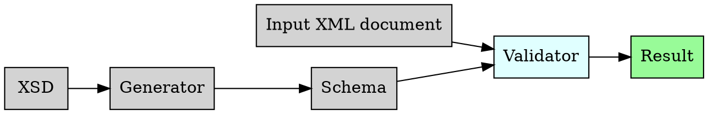
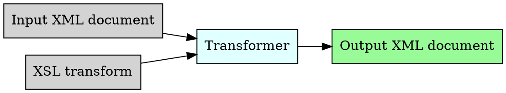

% Advanced XML

**Important resources:**

- [XSD Schema](https://www.w3schools.com/Xml/schema_intro.asp)
- [XSLT Introduction](https://www.w3schools.com/Xml/xsl_intro.asp)
- [PostgreSQL XML type](https://www.postgresql.org/docs/16/datatype-xml.html)
- [PostgreSQL XML functions](https://www.postgresql.org/docs/16/functions-xml.html)

In today's lab we'll look at some more advanced XML features.
We'll primarily use `lxml` in Python to explore these.

We will also briefly look at some functionality PostgreSQL provides to handle XML documents.
The XML support is less flexible and useful than the `json` and `jsonb` types but can be useful in some cases.


# Connecting

## Remote or laptop students

*Skip if on a lab machine*

[Connect to the VPN](https://dkitvpn.dkit.ie) at the beginning of this class.


## Login to the shared server

As per last week, we'll login to the shared lab server.

```bash
ssh yourname@10.200.172.60
```


# Real-world XML issues

XML documents we may encounter or be required to produce may involve:

1. Namespaces
2. Validity checks
3. Transforms
4. Advanced XPath usage


# XML namespaces

One of the most problematic things you will encounter from a practical and consumption-centric viewpoint in XML is namespaces, specified by `xmlns` attributes usually on the root element.

XML namespaces were originally conceived as a way to avoid element name conflicts when one XML document is embedded within another.
However they add extreme complexity to what should be otherwise simple reading and navigation operations. 

You will often encounter them even in a document made by a single producer, becuase they have an `xmlns` attribute on the root element.


## Default namespace

A document with an `xmlns` attribute on the root element has a default namespace "owned" by the organisation, conventionally written as a URL (but need not resolve to one).

It would usually be expected that a particular namespace has some governing rules expressed as an XML Schema or a SGML Document Type Declaration.

These documents are simple once you know how to remove or strip the XML namespace information if it's problematic.


## Prefixed namespaces

Sometimes we have one or more namespaces defining a prefix.
If we had for example an XML doc:

```xml
<?xml version="1.0" ?>
<itinerary
xmlns:bus="http://bus.company/here"
xmlns:train="http://train.company/here"
xmlns="http://ferry.company/default/namespace"
>
	<bus:journey>
	<!-- a bus journey with elements relating to bus co -->
	</bus>
	
	<train:journey>
	<!-- a train journey w/ elements relating to train co -->
	
	<journey>
	<!-- a ferry journey w/ elements relating to ferry -->
	</journey>
</itinerary>
```


## Can we just ignore them?

It would be great if we could!
*BUT*
Some tools that we use for schema checking and transforms use them to work. 

The good news is that we can ignore them for the most part, and can sometimes strip them if they are causing a problem.


# Validity

Last week we looked at well-formed XML.
This is distinct from *Valid* XML.
A Valid XML document obeys a machine-readable set of validity rules.

There are a few ways to check validity:

1. Document Type Declaration (older)
2. XML Schema (newer)
3. RelaxNG
4. Schematron

We'll *briefly* look at XML schemas but more from a general usage point-of-view.
We won't spend time writing schemas from scratch.


## Well-formed prerequisite

In order for an XML document to be valid, it must be well-formed.


## XML Schema validation

Schema validation is a process where a given *document* is evaluated against the rules specified in the *schema*.
If no rules are found to be broken, the document is valid.




## XML Schema example

Let's take the fixed `bathe_cat.xml` from last week.
It's by no means a great example of an XML document but it's enough to get us going!

Let's try to load it in Python:

```python
# lxml etree import
from lxml import etree

# read in bathe_cat.xml
with open('bathe_cat.xml','r') as f:
	doc = etree.parse(f)
	
# root element
procedure = doc.getroot()
```

## Schema document

Looking at the XML document:

1. Root element is `PROCEDURE`.
2. Root element has `TITLE`, `OVERVIEW` and `WARNING` elements that all contain text.
3. It has `EQUIPMENT` element with one or more `ITEM` elements containing text within.
4. It has `INSTRUCTIONS` element with one or more `STEP` elements containing text within.


An XML Schema to encode the requirements above is given in the `procedure.xsd` file.


## Document validation at command-line

In UNIX systems if we have the `.xsd` and a given `.xml` file we can use `xmllint`'s `--schema` option to test if the document validates against the schema.

```bash
xmllint --schema procedure.xsd bathe_cat.xml 
```

If the document validates `xmllint` will by default print out the document followed by a confirmation that it is valid.


## Validating the document

We will first use `lxml` to load the schema, creating a Schema object, and then validate the document against the schema.

```python
# load the schema XML document
with open('procedure.xsd','r') as f:
	schema_doc = etree.parse(f)
	
# make a schema object from the schema doc
schema = etree.XMLSchema(schema_doc)

# use the schema to validate the original doc
schema.validate(doc)
# result will be boolean
```

If we want a failure to validate to cause a Python exception we can instead use:

```python
schema.assertValid(doc)
```

This will also contain the traceback of validation errors.


## Schema design


Schema design can get very complicated!
This class has only a basic schema so you'll understand the purpose and basic capabilities.


## Use cases

If you're receiving XML from multiple different producers that is supposed to conform to a given XSD file, then you really should use it!

If you're receiving XML from other producers and have a set of rules but no XSD (or alternative like DTD) then you should consider creating one or consulting with someone to create one with/for you. 

If you're being asked to produce XML to send on elsewhere according to a set of rules, then you and the receiver should agree on encoding them as an XSD to avoid any misunderstandings.


# XSL Transforms

XSL transforms allow us to convert an XML document to another XML document or to generic text formats.




XSL Transforms are written as XML documents .
When stored on disk it's conventional to use `.xsl` as the file extension for them. 

XSL itself is a powerful tool, and historically was often used to transform XML documents to to alternative formats like plain text and HTML, as well as other XML documents.
In real situations in 2025 it's often easier to write a script in a procedural language like Python to do the same thing as an XSL transform in a shorter time. 


## Conversion to other XML documents.

XSL's primary function is to convert from one document to another.
Let's say we wanted a slightly different version of `bathe_cat.xml`, we could have an XSL transform.


```python
# assume original doc is root 

# open the XML file defining the XSL transform
xslt_file = open('summary.xsl','r')

# parse the XSLT (same as an XML file)
xslt_root = etree.parse(xslt_file)

# create the transformer from the XSLT
transform = etree.XSLT(xslt_root)

# apply the transform
transform_result = transform(root)

# get the document root
root = transform_result.get_root()

```


## Conversion to non-XML formats

XSL can also convert an XML document to a non-XML string representation. 
This can be used for a variety of purposes.


## Removing XML namespaces

On a practical level it's often easiest to strip namespaces from documents where there is no risk of clash. 

To do this we will use an XSL Transform to modify the original XML document so that the namespace declarations are removed.
Then many of our tools will be a lot easier to work with. 

We'll use `lxml` to load the XML document defining the transform, create a transform object and then apply it to the original XML document. 

The particular document we'll use is called an *identity transform* that will pass through the document but will strip namespace information from it.

```python
# assume original doc is root 

# open the XML file defining the XSL transform
xslt_file = open('remove_namespaces.xsl','r')

# parse the XSLT (same as an XML file)
xslt_root = etree.parse(xslt_file)

# create the transformer from the XSLT
transform = etree.XSLT(xslt_root)

# apply the transform
transform_result = transform(root)

# get the document root
root = transform_result.get_root()
```


# XML support in PostgreSQL

PostgreSQL can understand XML to a lesser extent that JSON, using its `xml` type. 
