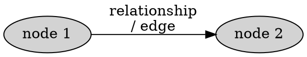
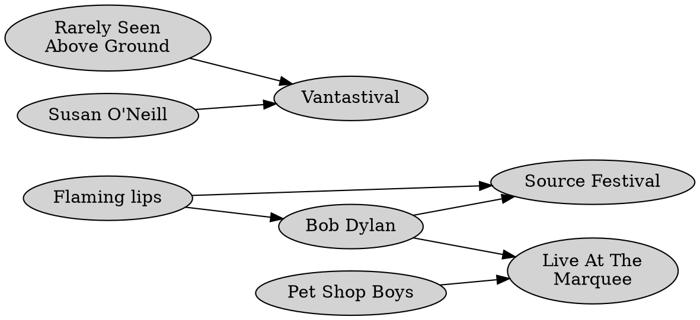
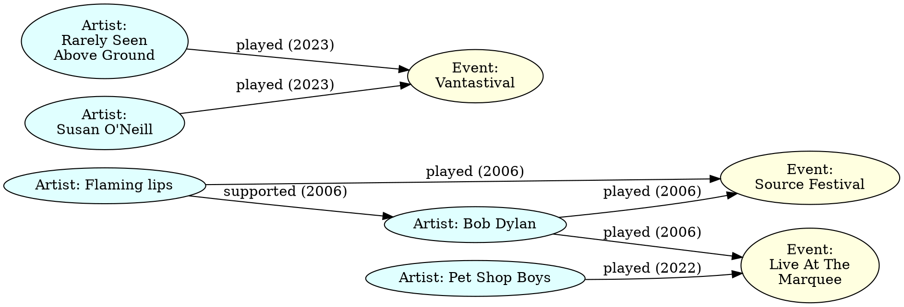

% Graph databases

We will largely be following the [Neo4J tutorial](https://neo4j.com/docs/getting-started/) online.


# Graph databases

A **graph database** differs from relational, document and other database types by focusing on **two** distinct record types: **nodes** and **relationships**.

Nodes are connected to each other by *relationships*.



## Nodes

Nodes normally represent entities / instances such as people, businesses, accounts, or any other item to be tracked:

- Nodes are *roughly* the equivalent of a row in a relational database, or a document in a document-store database.
- Nodes can have *properties* / *attributes* that store information about them.


## Edges / relationships

Edges / relationships connect nodes to other nodes, representing the relationships between them.



**Key concepts:**

- Edges can be directed or undirected (database dependent)
- Edges can have properties / attributes that store information about the relationship.

Edges as a first-class construct are the key differentiator of a graph database:

- Edges don't have a direct analogue in RDBMS or Document DBs. 
- Generally need a table and foreign key to implement in RDBMS.
- DocumentDB can use *references* in some cases to do this.


## Labels

Just as we have separate tables in RDBMS or collections in document databases, we have **Labels** in Graph databases as a high-level categorisation tools for nodes and edges.

Generally we use labels to differentiate different types of:

- nodes, e.g. Person, Interest, Topic, Course, Flight etc.
- relationships, e.g. Played, Liked, Has etc.





## Properties

Any node or edge can have properties associated with it.


# Neo4J

The Graph database we'll use is called Neo4J.
It shares a number of similarities with PostreSQL and MongoDB:

- Client/server model
- Text-based query language
- Has drivers for Python (and other languages)

Unlike our work with Postgres and MongoDB we'll work with Neo4J locally on our own machine.

Neo4J is also becoming increasingly problematic to deploy and use due to the restrictions placed on it by its developers.


## Cypher

[Cypher](https://en.wikipedia.org/wiki/Cypher_(query_language)) is Neo4J's inbuilt query language, designed for Graph databases.

It is conceptually similar to SQL in that it's designed to fit the Graph database model, rather than MongoDB's reuse of JavaScript.


## Installation

To install Neo4J go to the [Neo4J download page](https://neo4j.com/download/).

Hit *Download*.

Fill in the form.  It seems a generic / zero phone number will work. 

The net screen has a license key.
Copy it to the clipboard and paste into a new text document.
You will need it when installing Neo4J.

You may need to click the correct direct download link for your machine's operating system.

Install the Neo4J app as appropriate for your operating system.

Start the Neo4J app.

In my opinion there's no need whatsoever to give Neo4J access to send notifications.

Agree to the license agreement.

On the **software registration** screen paste the license key you got earlier in to the right hand side box, ignoring the left.
Click *Activate*.

The rest of the inital setup will take a few minutes.


# Basic database example

We will start off building a basic database with a few nodes and relationships, query it and learn how to make basic modifications. 


## Creating a blank database

We'll start from a blank slate to begin with.
Go to Projects and delete the existing one.

Go to **New**, then **Create Project**.

Add a new **Local DBMS** with a password of your choice.
*This can be reset easily enough if you forget it.*

Then hit **Start**.

Finally hit **Open**.


## Creating a node

Nodes are created using the [CREATE](https://neo4j.com/docs/cypher-manual/current/clauses/create/) clause. 

```cypher
CREATE (n:Artist {name:'Bob Dylan'})
```

Neo4J visually will use the `name` property where present to show on the node.
Now create another node, e.g.:

```cypher
CREATE (n:Event {name:'Source Festival', location:'Kilkenny'})
```
This time we have a different Label (Event) and have added two properties.


## Showing all nodes

Our first query will simply return all nodes in the browser: 

```cypher
MATCH (n) RETURN n
```

The actual variable name we use doesn't matter.
I tend to use `n` but you can use anything you like.


## Querying for specific node types

If we only wanted a particular type of node by Label, we can specify it:

```cypher
// return only Artist nodes
MATCH (n:Artist) RETURN n 
```


## Creating a relationship

A relationship normally requires two nodes.
We can technically have a *recursive relationship* that starts and ends on the same node.

Creating a relationship can seem tricky at first.
We need to *bind* the existing nodes to variables and create the relationship between them. 

```cypher
MATCH (artist:Artist {name: 'Bob Dylan'}), (event:Event {name: 'Source festival'})
CREATE (artist)-[:PLAYED]->(event)
```

There is an alternative syntax that lets you create nodes and their relationships simultaneously.
Be careful using this as you can end up creating multiple identical nodes when you didn't mean to.


## Exercise

Create the rest of the bands / events diagram from above.

Use the query to display all nodes / relationships after each step so you can get used to it. 


## Querying for nodes

To choose specified nodes to return, we use `MATCH` with qualifiers: 

```cypher
// only return specific node types
MATCH (n:Artist) RETURN (n)

// only return nodes with matching properties
MATCH (n {name: 'Bob Dylan'}) Return (n)

// same as before but only nodes with a specific label
MATCH (n:Artist {name: 'Bob Dylan'}) Return (n)
```


## Querying for relationships

```cypher
```

## SET properties

To set a property on an existing node or edge use `MATCH` with `SET`.

```cypher
MATCH (e:Event {name: 'Source festival'}) REMOVE e.price
```

## REMOVE properties

To remove a property from an existing node or edge we use `MATCH` with `REMOVE`.

```cypher
MATCH (e:Event {name: 'Source festival'}) REMOVE e.price
```

## Deleting all nodes

We use `MATCH` with `DELETE`:

```cypher
MATCH (n) DELETE n 
```

### Deleting all nodes and their relationships

Given that most nodes will have relationships we generally instead can use:

```cypher
MATCH (n) DETACH DELETE n
```


# Your own database

Choose from one of these options:

1. Destinations you've visited and activities / attractions in them.

2. Your own version of the gig / event record.

3. Another simple graph that you could draw on paper.


# Python connectivity

[Neo4J Python Driver Manual](https://neo4j.com/docs/python-manual/current/)


MATCH (p:Person {name:'Mary'})-[r:FOLLOWS]->(s:Sport {name:'F1'}) DELETE r