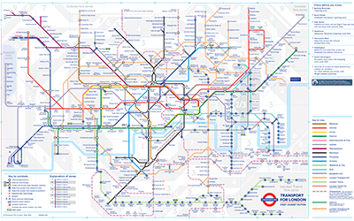

% Applied Graph Databases

**Important resources:**

- [Cypher manual](https://neo4j.com/docs/cypher-manual/current/introduction/)
- [Neo4J python module manual](https://neo4j.com/docs/python-manual/current/)
- [Dijkstra Source-Target Shortest Path](https://neo4j.com/docs/graph-data-science/current/algorithms/dijkstra-source-target/)


# Requirements

For today's exercise you will need:

- Working instance of Neo4J that you can access
- Python
- neo4j python library


# Tutorial

Follow pathfinding tutorial with the 6 nodes.


# Background

London's Underground network is probably known best by its iconic Tube Map:



We are going to use Neo4J to perform *pathfinding* from one station to another using Python.

I have used here the input data from [tubemaps](https://github.com/nicola/tubemaps) by the github user [nicola](https://github.com/nicola). You should consult the [README](https://github.com/nicola/tubemaps/blob/master/README.md) on this dataset for further info on it.


# Connection

Make sure your neo4j server is running.

Then in your preferred Python interpreter connect to Neo4J.

```python
# neo4j
from neo4j import GraphDatabase
URI = "neo4j://localhost"
AUTH = ("neo4j", "1Password2025.")
driver = GraphDatabase.driver(URI, auth=AUTH)
driver.verify_connectivity()

# pandas (needed later on)
import pandas as pd
```


## Purging DB


```cypher
// delete relationships
match ()-[r]->() delete r

// delete nodes
match (n) delete n
```


# Loading data

## Stations

The list of stations is in `stations.csv`. 

### Reading from CSV

We'll first read it into a pandas dataframe:

```python
stations = pd.read_csv('stations.csv')
```

### Query

Next we'll construct a template Cypher query to create a node.

```python
query = 'CREATE (n:Station {id: $id, name: $name, zone: $zone}) RETURN (n)'
```

### Insertion

Now let's loop over the dataframe, executing the query with the named parameters provided.

```python
for idx, row in stations.iterrows():
	driver.execute_query(query, id=row['id'], name=row['name'], zone=row['zone'])
```

### Confirm insertion

Now in Cypher let's confirm that the nodes have been inserted

```cypher
match (n:Station) return n
```

## Lines

The lines information is stored in `lines.csv`.
Although we'll use lines in relationships, we also want to store their existence as nodes in the DB.

### Reading in CSV

We'll again use the Pandas `read_csv` method:

```python
lines = pd.read_csv('lines.csv')
```


### Query

Next we'll construct a template Cypher query to create a line.

```python
query = 'CREATE (n:Line {id: $id, name: $name}) RETURN (n)'
```


### Insertion

Same as before, executing the query with the named parameters provided.

```python
for idx, row in lines.iterrows():
	driver.execute_query(query, id=row['line'], name=row['name'])
```


## Connections

The connection information between stations is stored in `connections.csv`.


### Reading in CSV

We'll again use the Pandas `read_csv` method:

```python
connections = pd.read_csv('connections.csv')
```


### Line mapping

The lines are given by number in the input CSV file but we want the name.
Let's make a simple dictionary to map the number to the line name.

```python
# empty dictionary
line_map = {}

# fill the dictionary
for idx, line in lines.iterrows():
	line_map[line['line']] = line['name']
```


### Query

Our template Cypher query needs to `MATCH` both stations and then create a relationship between them using the `time` information in `connections`.

```python
query = 'MATCH (s1:Station {id:$s1}), (s2:Station {id:$s2}) CREATE (s1)-[r:TRAIN {time:$time,line:$line}]->(s2)'
```


### Insertion

Same as before, executing the query with the named parameters provided.
We have our line map to fill the name.

```python
for idx, row in connections.iterrows():
	driver.execute_query(query, s1=row['station1'], s2=row['station2'], line=line_map[row['line']], time=row['time'])
```


# Queries

## Looking at a line

Let's say we wanted to get a diagram of a particular line:

```cypher
MATCH path = (a:Station)-[:TRAIN {line:"East London Line"}]-(b:Station) RETURN path
```

Note that the visual rendering in Neo4J desktop has no correlation to the geographic co-ordinates!

## Direct connections from a Station

```cypher
MATCH path = (:Station {name: 'Liverpool Street'})-[]-(:Station) RETURN path
```

# Pathfinding

## Graph projection

```cypher
MATCH (source:Station)-[r:TRAIN]->(target:Station)
RETURN gds.graph.project(
  'tube',
  source,
  target,
  { relationshipProperties: r { .time } }
)
```

## Pathfinding algorithm

```cypher
MATCH (source:Station {name: 'Kennington'}), (target:Station {name: 'Stockwell'})
CALL gds.shortestPath.dijkstra.stream('tube', {
    sourceNode: source,
    targetNodes: target,
    relationshipWeightProperty: 'time'
})
YIELD index, sourceNode, targetNode, totalCost, nodeIds, costs, path
RETURN
    index,
    gds.util.asNode(sourceNode).name AS sourceNodeName,
    gds.util.asNode(targetNode).name AS targetNodeName,
    totalCost,
    [nodeId IN nodeIds | gds.util.asNode(nodeId).name] AS nodeNames,
    costs,
    nodes(path) as path
ORDER BY index
```


## Deleting a projected graph

```cypher
CALL gds.graph.drop('tube')
```
