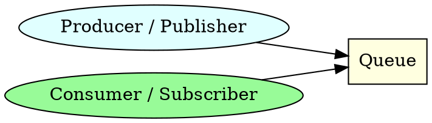
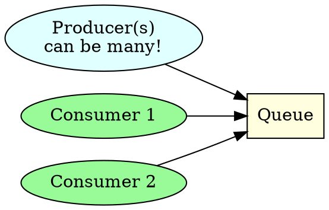

% Queues

Today's lab will look at messaging queue systems. 

**Useful links:**


- [Wikipedia article on AMQP](https://en.wikipedia.org/wiki/Advanced_Message_Queuing_Protocol)
- [RabbitMQ documentation](https://www.rabbitmq.com/tutorials/tutorial-one-python)
- [AWS guide to messaging queues](https://aws.amazon.com/message-queue/)


*Today's lab is a very simplified introduction to messaging queue systems. You'll probably find that systems you encounter or build differ a bit from the example presented here, but the basic ideas are the same.*


# Login

Today's class will make use of the shared server:

```powershell
ssh yourname@10.200.172.60
```


# Message Brokers

Message brokers are a server process (similar to a DBMS) that run normally on a dedicated computer in a data centre environment or cloud.
They can however also run locally on a desktop / laptop co-located with some or all of the programs using them.

We are using RabbitMQ as our broker. 
This is a very commonly used Broker that supports a number of different messaging protocols.


## Clients

Message brokers are unusual in that there are two separate client types



- **Producers / Publishers** send (or enqueue) messages into a named queue on the broker.
- **Consumers / Subscribers** receive (or dequeue) messages from a named queue on the broker. 


## Brokers and Protocols

Unlike most DBMS where each DBMS has its own communication protocol, there are a number of messaging protocols supported by a number of different brokers. 

The **protocol** we'll use today is called AMQP. 
AMQP is normally on TCP Port 5672.

The **broker** implementing the AMQP protocol that we'll use in today's lab is called RabbitMQ and is a commonly deployed broker in on-premises and cloud setups. 

To access the broker from our own Python code we'll use the `pika` AMQP liibrary. 


## Lab setup

Each RabbitMQ server supports 1 or more *vhosts* which are conceptually like a database in a DBMS. 
In the lab configuration:

- Server host: 10.200.172.54
- Port: 5672
- Username: same as database server username
- Each student has their own vhost named the same as their username. 
- Default password is `1Password`. 
- You have full control of your rabbitmq vhost in terms of creating / deleting queues. 


# Basic functionality

We'll be following the [RabbitMQ Python Hello World tutorial](https://www.rabbitmq.com/tutorials/tutorial-one-python).


## Sending a message

We'll first try sending a couple of messages using python interactively.
Run `ipython3` and try the following:

### Pika module import

```python
# import the pika library
import pika
```

### Connection

The first thing we need to do is to establish a connection with RabbitMQ server.
This can be a bit cumbersome compared to the tutorial, as we're connecting to a remote machine which means we need to set up credentials and a connection parameters object. 

```python
# review help for connection object and connection parameters
help(pika.BlockingConnection)
help(pika.ConnectionParameters)

# credentials
from pika.credentials import PlainCredentials
credentials = PlainCredentials('grantpdev','1Password')

# setup the connection parameters
params = pika.ConnectionParameters('10.200.172.54',virtual_host='grantpdev', credentials=credentials, heartbeat=3600)

# create a connection object
connection = pika.BlockingConnection(params)

# create channel
channel = connection.channel()
```

### Queue

Next, before sending we need to make sure the recipient queue exists. If we send a message to non-existing location, RabbitMQ will just drop the message. 
Let's create a *hello* queue to which the message will be delivered:

```python
channel.queue_declare(queue='hello')
```

*This will return output, which is fine!*


### Send message

At this point we're ready to send a message. Our first message will just contain a string `Hello World!` and we want to send it to our `hello` queue.

As the tutorial states: 
- In RabbitMQ a message can never be sent directly to the queue, it always needs to go through an *exchange*.
- For now we'll just use the *default exchange* identified by an empty string.
- The default exchange allows us to specify exactly to which queue the message should go.
- The queue name needs to be specified in the `routing_key` parameter.

To send a message: 

```python
channel.basic_publish(exchange='', routing_key='hello', body='Hello World!')
```

*This command will return nothing by default.*


### Send some more messages

Repeat the previous command a few times to send approx 5-10 messages into your queue.


## Receiving messages

Receiving messages is a little more complex. 

Basically we define a *callback function* and then tell the `channel` object to call this function when it receives a new message.


### Python interpreter

Open a new TMUX window and run `ipython3`, leaving your original window intact. 

### Connection

Re-run the connection commands from the sending messages section.

### Queue

Queue declaration / creation is idempotent.
Confirm that the queue exists by running:

```python
channel.queue_declare(queue='hello')
```

### Callback function

Next we define the *callback function* which is going to process each received message. 
Ours is just going to print the `body` to the screen and will ignore the other provided information. 

```python
def callback(ch, method, properties, body):
    print(f" [x] Received {body}")
```

You can obviously adapt this pattern to do anything you like, e.g. fill values received into a DBMS, send an email, print a ticket, whatever.


### Consuming messages

First, we will configure our channel to consume messages on the `hello` queue and send them to the `callback` function we defined earlier: 

```python
channel.basic_consume(queue='hello', auto_ack=True, on_message_callback=callback)
```

Then we can enter a never-ending loop:

```python
channel.start_consuming()
```

Note that the messages you sent are all received.
Now, you can go back to the other python session and send a few more messages, note that they're now received as well.


# Work queues

We'll carry on using the [work queues RabbitMQ tutorial](https://www.rabbitmq.com/tutorials/tutorial-two-python):

- This is conceptually identical to the previous example except we now have two (or more) consumers attached to the queue at one time. 
- We also need to deal with the issue of *message acknowledgment* to cover situations where the workers fail.



For this example we'll keep our python session for sending the messages open. 
We'll now quit the receiving one using Ctrl-C.


## Basic Worker

I've implemented a basic worker in `qprocessor.py` that you're free to use as a starting template for your own work:

- It prints out the message received in the message body.
- It fakes a delay of the same number of seconds as there are characters in the message.
- It also can deliberately lose some messages


### Uploading

Upload the `qprocessor.py` script to the server using SFTP.


### Running


Run it using

```bash
./qprocessor.py  
```

You will need to supply the `--host`, `--vhost`, `--username`, `--password` and `--queue` options!

Send a few messages in to the queue from the original python session. 


## Load balancing

We could load-balance the queue by using multiple workers. 
We just need to run multiple workers at the same time. 
Try running a second instance of the worker in another TMUX window (or pane), and send in a few different messages into the queue together.

Notice how the messages are distributed between the two workers. 
You can if you like add another 1-2 workers, even during processing.
Best to put them in multiple panes in a single TMUX window so you can see everything that is going on!


## Work failures

Any work process can go wrong.
Let's quit one of our workers and re-start it with the `--lose-every 3` flag so that it will lose 1 message in every 3. 

These failures aren't picked up, so the messages get lost.


## Message acknowledgments

We can make our queue tolerent to failures in the workers by using message acknowledgements.
This separates the reception of the message from its deletion.

When the message is received by a worker it's hidden.
Once the worker is finished processing the message it then deletes it.
If the worker fails to do this within the delivery tieout period (as set on the RabbitMQ server) the message will be re-delivered to another worker.

Previously we turned on `auto_ack`. 
This time we'll leave it off (the default). 
The `qprocessor.py` program has an `--acknowledge` switch that does two things:

- Turns off the `auto_ack`.
- Sends an acknowledgement after each message has been processed.

By default, a worker that has failed will be disconnected.
You may need to "wrap" a worker appropriately so that it can restart if feasible. 


# Queue deletion

You can delete a queue from `pika` in Python using:

```python
channel.queue_delete(queue='hello')
```
Before issuing this command you should make sure that there are no producers or consumers connected to it.


# Queue Durability

*For discussion*


# Fair dispatch

*For discussion*


# Issues

## Timeouts

If you see:

```
StreamLostError: Stream connection lost: ConnectionResetError(104, 'Connection reset by peer')
```

it's because of activity timeouts on the server.
Make sure to increase the `heartbeat` connection parameter.

