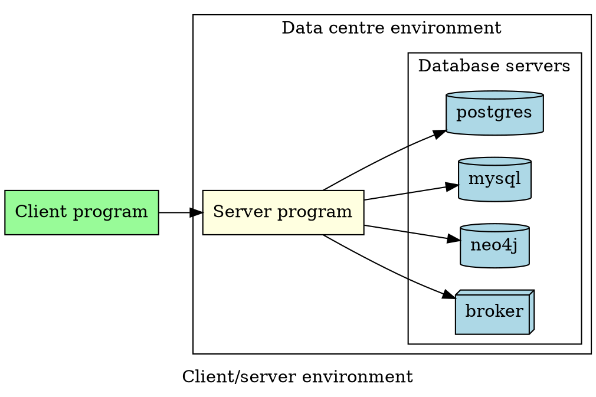

% GraphViz example lab

*This is a very quick intro to GraphViz based on class on 09/04/2025.*


# Functionality

GraphViz is able to take a text description of a connected graph and output it as an image.
For example, the following graph:



was produced by:

```
digraph G {

    label="Client/server environment";
    
    rankdir=LR;

    node [style=filled,shape=rectangle ];

    client [label="Client program", fillcolor=palegreen ];

    subgraph cluster_dc {
	label="Data centre environment";

    program [label="Server program", fillcolor=lightyellow] ;
	
    node [shape=cylinder, fillcolor=lightblue];

    subgraph cluster_db {
	label="Database servers";
    postgres ;
    mysql ;
    neo4j ;

    broker [shape=box3d];
    }
    }

    program -> postgres ;
    program -> mysql ;
    program -> neo4j ;
    program -> broker ;
    client -> program ; 

    
    
}
```

Sometimes it can be useful for Python or other programs to produce GraphViz output.


# Getting GraphViz

GraphViz is a command-line program (despite making images). 
It was originally designed for Unix platforms but works fine on Windows via PowerShell.


## Checking for GraphViz

If graphviz is installed, the `dot` command will be present:

```bash
which dot
```

GraphViz is installed on the shared server, but you won't directly be able to view any images it creates. 


## Installation

### Linux / Unix

Install via your package manager (apt, yum) or configuration management tool (ansible, cloud-init). 


### Mac

Install via homebrew or macports.


### Windows

Install directly from the [MSI package](https://gitlab.com/api/v4/projects/4207231/packages/generic/graphviz-releases/12.2.1/windows_10_cmake_Release_graphviz-install-12.2.1-win64.exe).


# Basic example

Copy and paste the code for the sample above into a file called `architecture.gv`.
We normally use `.gv` as the extension for GraphViz files. 


## Converting

To generate a PNG image file we can use: 

```bash
dot -Tpng -o architecture.png architecture.gv
```

We can follow the same pattern (changing the `-T` argument and output filename extension) to get: `.jpg`, `.svg`, `.pdf` and more. 
The GraphViz docs have a [full list of output formats](https://graphviz.org/docs/outputs/). 


# Other things you can do with GraphViz

- Much more complicated node shapes 
- Wrap GraphViz with a script to preview changes live
- Integrate with document processors like pandoc or latex


